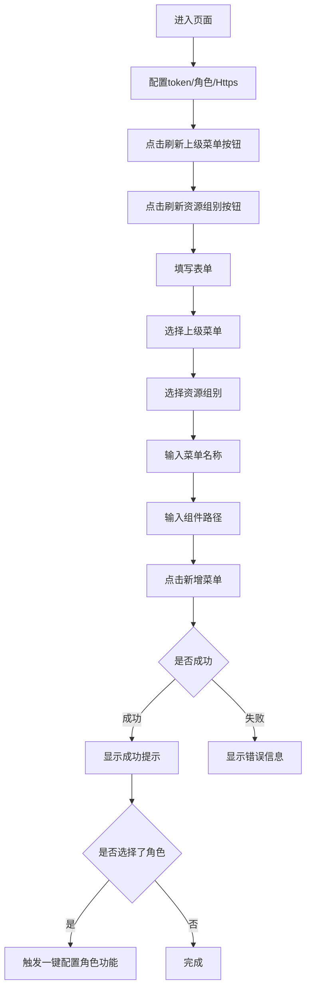

# 菜单配置功能实现文档

## 文档信息
- **创建日期**: 2025-11-11
- **任务描述**: 在"系统配置与批量登记"下方新增菜单配置卡片,实现新增菜单功能
- **涉及文件**: GlobalContext.jsx, SharedConfig.jsx, MenuConfig.jsx, App.jsx, main.jsx

---

## 一、需求分析

### 1.1 核心需求
1. 将token、角色选择、Https开关抽离为全局状态管理
2. 在"权限登记"Tab的"系统配置与批量登记"下方新增"系统菜单配置"卡片
3. 实现新增菜单功能,调用六个后端接口:
   - 接口1: 获取上级菜单树: `/dev-api/admin/api/v1/baseresource/getBaseResourceTree`
   - 接口2: 新增菜单: `/dev-api/admin/api/v1/baseresource/addBaseResource`
   - 接口3: 获取资源组别: `/dev-api/admin/api/v1/sysdictdata/querySysDictDataIdAndName`
   - 接口4: 获取系统列表: `/dev-api/admin/api/v1/application/getApplicationIdAndName`
   - 接口5: 菜单配置给系统: `/dev-api/admin/api/v1/resource/saveApplicationResourceBatch`
   - 接口6: 菜单配给角色: `/dev-api/admin/api/v1/roleResource/saveRoleResourceBatch`
4. 实现一键配置给角色功能(接口5→接口6)
5. 进入页面时不自动请求,手动点击按钮触发
6. 上级菜单树形选择支持根据baseResourceName过滤
7. 权限类型独立配置(1-页面,2-主子菜单)

### 1.2 技术要点
- 使用React Context API实现全局状态管理
- 组件化设计,提高代码复用性
- localStorage持久化存储用户配置
- TreeSelect支持搜索过滤

---

## 二、架构设计

### 2.1 文件结构
```
src/
├── GlobalContext.jsx      # 全局状态管理Context
├── SharedConfig.jsx       # 共享配置组件(token/角色/Https)
├── MenuConfig.jsx         # 菜单配置组件
├── App.jsx               # 主应用(已重构)
└── main.jsx              # 入口文件(包裹GlobalProvider)
```

### 2.2 数据流设计
```
GlobalProvider (全局状态)
    ├── token (string)
    ├── roleId (string)
    ├── isHttps (boolean)
    └── baseUrl (computed: /prod-api | /https-api)
         ↓
    SharedConfig (共享配置UI)
         ↓
    MenuConfig (菜单配置业务逻辑)
```

---

## 三、实现细节

### 3.1 GlobalContext.jsx - 全局状态管理

**功能说明**:
- 管理token、roleId、isHttps三个全局状态
- 自动同步localStorage实现持久化
- 动态计算baseUrl

**核心代码**:
```javascript
export const GlobalProvider = ({ children }) => {
    const [token, setToken] = useState(() => localStorage.getItem('token') || '');
    const [roleId, setRoleId] = useState(() => localStorage.getItem('roleId') || '');
    const [isHttps, setIsHttps] = useState(() => localStorage.getItem('isHttps') === '1');
    const [baseUrl, setBaseUrl] = useState(() => 
        localStorage.getItem('isHttps') === '1' ? '/https-api' : '/prod-api'
    );
    
    // 自动同步到localStorage
    useEffect(() => {
        if (isHttps) {
            localStorage.setItem('isHttps', '1');
            setBaseUrl('/https-api');
        } else {
            localStorage.removeItem('isHttps');
            setBaseUrl('/prod-api');
        }
    }, [isHttps]);
    
    return (
        <GlobalContext.Provider value={{ token, setToken, roleId, setRoleId, isHttps, setIsHttps, baseUrl }}>
            {children}
        </GlobalContext.Provider>
    );
};
```

**使用方式**:
```javascript
const { token, roleId, baseUrl } = useGlobalContext();
```

---

### 3.2 SharedConfig.jsx - 共享配置组件

**功能说明**:
- 提供token输入框
- 提供角色选择下拉框
- 提供Https开关
- 可在多处复用

**组件接口**:
```javascript
<SharedConfig 
    roleData={roleData}        // 角色列表数据
    onGetTreeData={getTreeData} // 获取树形数据回调
/>
```

---

### 3.3 MenuConfig.jsx - 菜单配置组件

**功能说明**:
1. 获取上级菜单树形数据
2. 获取资源组别数据
3. 新增菜单
4. 预留一键配置角色权限功能

**接口调用**:

#### 接口1: 获取上级菜单树
```javascript
const getMenuTree = async () => {
    const { data } = await Http.post(
        `${baseUrl}/admin/api/v1/baseresource/getBaseResourceTree`,
        { name: '', url: '' },
        { headers: { 'Authorization': token } }
    );
    setMenuTreeData(data.data);
};
```

#### 接口2: 新增菜单
```javascript
const params = {
    id: '',
    baseResourceGroupId: values.baseResourceGroupId,
    component: values.component,
    iconBase64: '',  // 写死为空
    name: values.name,
    path: '/home/leftNav/',  // 写死
    pid: values.pid,
    remark: '',  // 写死为空
    resourcetype: 1,  // 写死为1
    sort: values.sort || 1,
    url: `/home/leftNav/${values.component}`  // 自动拼接
};

await Http.post(
    `${baseUrl}/admin/api/v1/baseresource/addBaseResource`,
    params,
    { headers: { 'Authorization': token } }
);
```

#### 接口3: 获取资源组别
```javascript
const getResourceGroups = async () => {
    const { data } = await Http.post(
        `${baseUrl}/admin/api/v1/sysdictdata/querySysDictDataIdAndName`,
        { dictType: 'menu_base_resource_group' },
        { headers: { 'Authorization': token } }
    );
    setResourceGroupOptions(data);
};
```

**表单字段**:
- `pid`: 上级菜单ID (必填,从树形选择器获取)
- `baseResourceGroupId`: 资源组别 (必填,从下拉框选择)
- `name`: 菜单名称 (必填,用户输入)
- `component`: 组件路径 (必填,用户输入,例如: Manufacturer)
- `sort`: 排序 (可选,默认为1)

**树形选择过滤功能**:
```javascript
<TreeSelect
    showSearch
    filterTreeNode={(inputValue, treeNode) => {
        // 根据baseResourceName进行过滤
        return treeNode.baseResourceName && 
               treeNode.baseResourceName.toLowerCase().includes(inputValue.toLowerCase());
    }}
/>
```

**预留接口位置**:
```javascript
// 预留: 一键配置菜单给对应角色的接口
const assignMenuToRole = async (menuId) => {
    // TODO: 后续实现一键配置给对应角色的功能
    // 示例接口调用(需要根据实际接口调整):
    // await Http.post(
    //     `${baseUrl}/admin/api/v1/role/assignMenuToRole`,
    //     { roleId: roleId, menuId: menuId },
    //     { headers: { 'Authorization': token } }
    // );
};
```

---

### 3.4 App.jsx - 主应用重构

**修改内容**:
1. 导入GlobalContext和新组件
2. 使用useGlobalContext替代本地状态
3. 在"系统配置与批量登记"区域使用SharedConfig组件
4. 在批量登记下方新增"系统菜单配置"卡片

**布局结构**:
```jsx
<Tabs defaultActiveKey="perm">
    <TabPane key="perm" label="权限登记">
        {/* 参数选择 */}
        <div className="section">...</div>
        
        {/* 生成结果 */}
        <div className="section">...</div>
        
        {/* 系统配置与批量登记 */}
        <div className="section">
            <SharedConfig roleData={roleData} onGetTreeData={getTreeData} />
            {/* PID选择和批量登记按钮 */}
            <Table columns={columns} dataSource={tableData} />
        </div>
        
        {/* 系统菜单配置 - 新增 */}
        <div className="section">
            <h2>系统菜单配置</h2>
            <MenuConfig />
        </div>
        
        {/* Vue代码生成 */}
        <div className="section">...</div>
    </TabPane>
</Tabs>
```

---

## 四、操作流程

### 4.1 新增菜单流程



### 4.2 操作步骤

1. **配置全局参数**
   - 输入token
   - 选择角色(可选)
   - 切换Https开关

2. **加载数据**
   - 点击"刷新上级菜单"按钮,加载菜单树
   - 点击"刷新资源组别"按钮,加载资源组别

3. **填写表单**
   - 在树形选择器中搜索并选择上级菜单
   - 选择资源组别(PC/APP/CMS等)
   - 输入菜单名称
   - 输入组件路径(例如: Manufacturer)
   - 设置排序(可选,默认1)

4. **提交新增**
   - 点击"新增菜单"按钮
   - 等待接口响应
   - 查看成功/失败提示

---

## 五、注意事项

### 5.1 必填参数
- token: 必须配置,否则无法调用接口
- 上级菜单: 必须选择
- 资源组别: 必须选择
- 菜单名称: 必须输入
- 组件路径: 必须输入

### 5.2 固定值
- `iconBase64`: 固定为空字符串 `""`
- `path`: 固定为 `/home/leftNav/`
- `remark`: 固定为空字符串 `""`
- `resourcetype`: 固定为 `1`
- `sort`: 默认为 `1`,可修改
- `url`: 自动拼接为 `/home/leftNav/${component}`

### 5.3 数据格式
- 上级菜单树数据字段映射:
  - `label`: baseResourceName
  - `value`: id
  - `children`: children

- 资源组别数据字段映射:
  - `label`: name
  - `value`: dictValue

### 5.4 错误处理
- token未配置: 显示"请先配置token"
- 接口调用失败: 显示具体错误信息
- 表单验证失败: 显示字段错误提示

---

## 六、后续优化建议

### 6.1 功能增强
1. ✅ 实现一键配置给对应角色的功能(已预留接口位置)
2. 增加菜单编辑功能
3. 增加菜单删除功能
4. 增加菜单列表查看功能
5. 支持批量新增菜单

### 6.2 用户体验
1. 增加加载状态提示
2. 优化错误提示信息
3. 增加操作确认弹窗
4. 支持表单数据缓存

### 6.3 性能优化
1. 菜单树数据缓存
2. 防抖处理搜索输入
3. 虚拟滚动优化大数据量

---

## 七、测试用例

### 7.1 功能测试
- [ ] 全局状态管理正常工作
- [ ] token/角色/Https切换正常
- [ ] 手动点击按钮加载数据
- [ ] 上级菜单树形选择正常
- [ ] 树形选择搜索过滤正常
- [ ] 资源组别下拉选择正常
- [ ] 表单验证正常
- [ ] 新增菜单接口调用成功
- [ ] 成功/失败提示正常显示

### 7.2 边界测试
- [ ] token为空时的处理
- [ ] 网络异常时的处理
- [ ] 接口返回异常数据的处理
- [ ] 特殊字符输入的处理

### 7.3 兼容性测试
- [ ] Chrome浏览器
- [ ] Edge浏览器
- [ ] Firefox浏览器

---

## 八、变更记录

| 日期 | 版本 | 修改内容 | 修改人 |
|------|------|----------|--------|
| 2025-11-11 | v1.0 | 初始版本,实现基础功能 | AI Assistant |
| 2025-11-11 | v1.1 | 移除自动加载,增加树形过滤 | AI Assistant |

---

## 九、相关接口文档

### 接口1: 获取上级菜单树
- **URL**: `/dev-api/admin/api/v1/baseresource/getBaseResourceTree`
- **Method**: POST
- **Headers**: `Authorization: {token}`
- **Request Body**:
```json
{
  "name": "",
  "url": ""
}
```
- **Response**:
```json
{
  "code": "00000",
  "data": [
    {
      "id": "1811292353730842624",
      "baseResourceName": "系统管理",
      "path": "/home/leftNav/",
      "component": "21303",
      "children": [...]
    }
  ]
}
```

### 接口2: 新增菜单
- **URL**: `/dev-api/admin/api/v1/baseresource/addBaseResource`
- **Method**: POST
- **Headers**: `Authorization: {token}`
- **Request Body**:
```json
{
  "id": "",
  "baseResourceGroupId": 1,
  "component": "Manufacturer",
  "iconBase64": "",
  "name": "制造商管理",
  "path": "/home/leftNav/",
  "pid": "1811292353730842624",
  "remark": "",
  "resourcetype": 1,
  "sort": 1,
  "url": "/home/leftNav/Manufacturer"
}
```

### 接口3: 获取资源组别
- **URL**: `/dev-api/admin/api/v1/sysdictdata/querySysDictDataIdAndName`
- **Method**: POST
- **Headers**: `Authorization: {token}`
- **Request Body**:
```json
{
  "dictType": "menu_base_resource_group"
}
```
- **Response**:
```json
[
  {
    "id": "1846355403953278976",
    "name": "PC",
    "dictValue": 1,
    "dictType": "menu_base_resource_group"
  }
]
```

---

## 十、总结

本次实现完成了菜单配置功能的核心需求:
1. ✅ 全局状态管理(token/角色/Https)
2. ✅ 共享配置组件抽离
3. ✅ 菜单配置卡片新增
4. ✅ 三个接口集成
5. ✅ 预留一键配置角色接口
6. ✅ 手动触发加载数据
7. ✅ 树形选择搜索过滤

代码结构清晰,组件化设计良好,易于维护和扩展。
